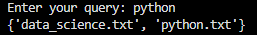

# Mini Search Engine

A search engine built from scratch in Python to explore the fundamentals of information retrieval, text processing, indexing, and search algorithms.

## Project Goal

The goal of this project is to understand how search engines work by implementing their core components without relying on external search-engine frameworks.

The project will gradually evolve from a basic keyword search system into a more advanced search engine with ranking and semantic search capabilities.

## Current Features

* Read `.txt` documents from a directory
* Tokenize and normalize text
* Build an inverted index
* Search documents using keywords
* Support multiple-word queries using OR-based retrieval
* Modular project structure

## Technologies

* Python
* `pathlib`
* `re`
* Python dictionaries and sets
* Basic Information Retrieval concepts


## Architecture

```text
Documents
    │
    ▼
Tokenizer
    │
    ▼
Document → Tokens
    │
    ▼
Inverted Index
    │
    ▼
Token → Documents
    │
    ▼
Search Query
    │
    ▼
Matching Documents
```

## Project Structure

```text
mini-search-engine/
│
├── tests/
│   └── *.txt
│
├── src/
│   ├── tokenizer.py
│   ├── indexer.py
│   └── searcher.py
│
├── main.py
├── README.md
├── .gitignore
└── requirements.txt
```

## How It Works

### 1. Tokenization

Documents are converted into normalized tokens.

For example:

```text
"Python is a powerful language!"
```

becomes:

```text
["python", "is", "a", "powerful", "language"]
```

### 2. Document Indexing

The documents are converted into an inverted index.

For example:

```text
python → {"python.txt", "ai.txt"}
algorithm → {"algorithms.txt"}
machine → {"machine_learning.txt"}
```

This allows the search engine to quickly find which documents contain a given word without scanning every document for every query.

### 3. Searching

A user's query is tokenized and each token is looked up in the inverted index.

For example:

```text
Query: python programming
```

currently performs an OR-based search and returns documents containing at least one of the query terms.

## Demo



## Status

🚧 **Early development**

The current version implements a basic inverted-index-based keyword search engine. More advanced retrieval and ranking techniques will be added progressively.
